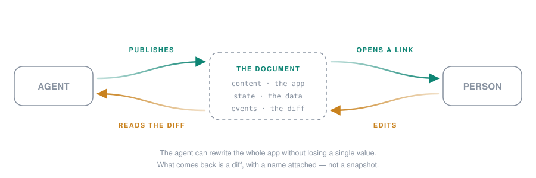
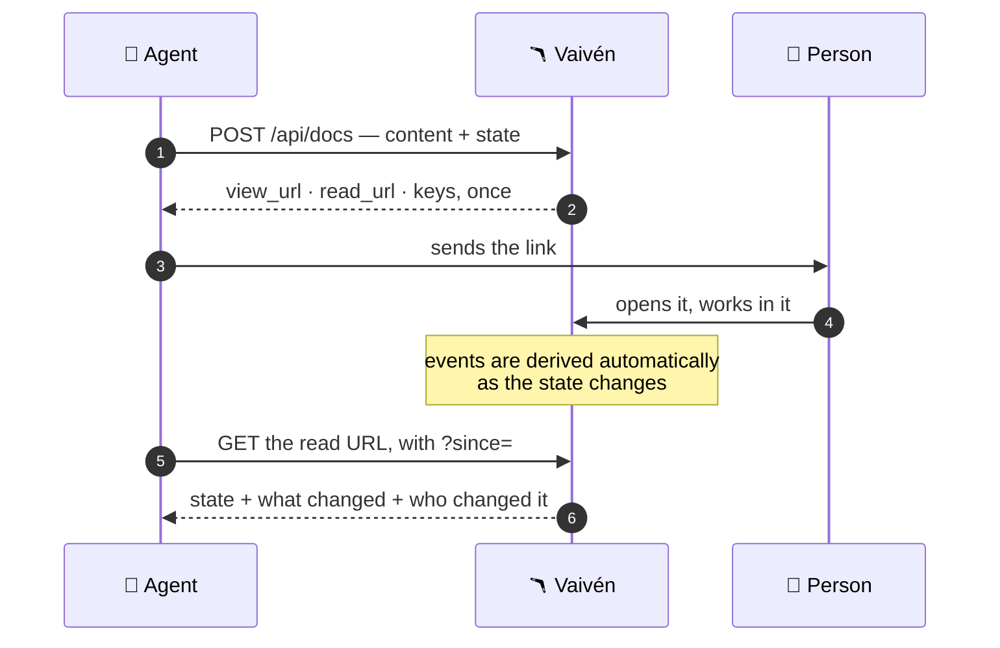
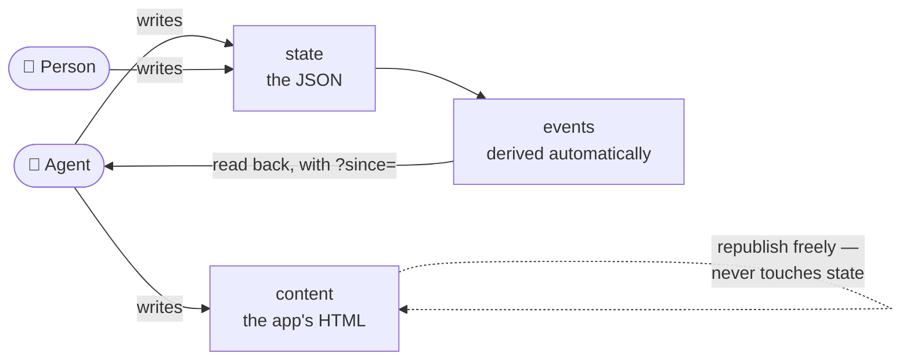
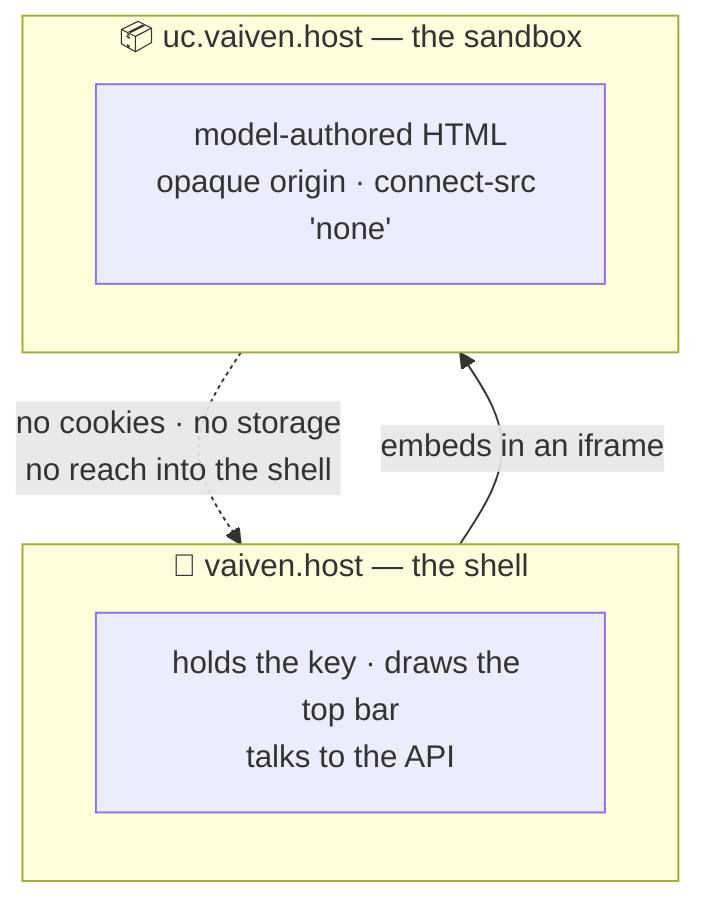

<h1> Vaivén</h1>

> **vaivén** *(n.)* — the back-and-forth of something that swings. A tide. A pendulum.
> A door that opens both ways.

**Living documents between an agent and a person. The agent publishes, the person edits,
the agent reads back exactly what changed — and who changed it.**


<p align="center"></p>

---

Every artifact an agent publishes is a message in a bottle. It floats off, somebody opens
it somewhere, and you never hear back. Maybe they loved it. Maybe they fixed your terrible
number. Maybe they never opened it at all. You get the same silence either way.

Vaivén is the tide coming in.

Same bottle — a small web app, published from one API call — except this one comes back,
with a note inside saying exactly what they changed, what it was before, and whose hands
it passed through.

```json
{ "state": { "fee": "900" },
  "events": [
    {"actor":"Marta","kind":"edit","field":"fee","from":"18400","to":"900"},
    {"actor":"Marta","kind":"edit","field":"deliverables","op":"add","item":"Extra budget"},
    {"actor":"Marta","kind":"done","note":"cut the fee, added a line"}
  ],
  "next_since": 7 }
```

That's a real response, from a plain URL, with no header, no SDK and no JavaScript. Marta
cut your fee by 95% and told you why. Now go and have feelings about it.

---

## The problem this closes

An agent can already publish something beautiful. What it cannot do is *watch someone use
it*. The moment the link leaves your hands, the loop breaks, and it gets patched by the
oldest technology in software:

> "Great, thanks! I've made a few changes, see attached."

You get a snapshot and have to diff it in your head. Or you ask people to paste things into
a chat window like it's 2011. Or you build a whole app with a database and a login page,
because you needed four numbers back from one person.

Vaivén replaces all of that with one call out and one URL back.

## Sixty seconds



**Publish something.** Ordinary HTML. Give every field a `name` — that's the entire
convention.

```bash
curl -s https://your-host/api/docs \
  -H "Authorization: Bearer $VAIVEN_KEY" -H 'content-type: application/json' \
  -d '{"title":"Harbour Lane fitout",
       "sender_note":"Could you check the fee and the dates? — sent by Ana",
       "read_key":true,
       "content":"<!doctype html><html><body><label>Fee <input name=\"fee\" value=\"18400\"></label></body></html>",
       "state":{}}'
```

You get back `view_url` (send this to a person), `read_url` (how you read it back), and the
key material, once.

**Someone works in it.** They open the link. There's no sign-up, no password, no app to
install. A bar across the top tells them their edits are recorded, under what name, and who
can read them back — plus your `sender_note`, if you set one. They type. It saves.

**Read back what changed.**

```bash
curl -s "https://your-host/r/YOUR_READ_KEY.json?since=128"
```

That's the loop. Everything else in this file is detail.

> **Writing an app against Vaivén?** You want **[`guide.md`](guide.md)** — the whole manual
> on one page, with working curl for every route, and nothing to fetch after it. It installs
> as an agent skill in one line. This file is about the idea, and about running the service.

## The trick: three layers

Everything hangs on refusing to store the app and the data in the same place.

| Layer | What it is | Who writes it |
|---|---|---|
| `content` | the app's HTML | the agent |
| `state` | JSON holding the data | the person, and the agent |
| `events` | what changed, with a name attached | derived automatically |



Which buys you the thing that makes this worth building: **the agent can rewrite the entire
app without losing a single value.** Change your mind about the layout at 11pm while someone
has the document open, republish, and their half-typed note is still there. The columns
move. The data doesn't.

And because `events` are derived rather than reported, nobody has to remember to log
anything. The person just works. The diff assembles itself behind them.

## Two ways to write the app

**Automatic.** Put `name` on your inputs and stop thinking about it. Values in the markup
become the starting state; everything typed is captured and restored on reload. A form is
about four lines of work.

**App mode.** If people can add, remove or reorder things, no amount of markup can restore
that structure, so you take over with a painter and a mutator:

```js
Vaiven.render(state => { … })   // runs when state arrives, and after every change
Vaiven.mutate(draft => { … })   // the only way to change state
```

That's most of the API. There is no framework here and no build step required — a document
is one file, and the sandbox will run whatever you put in it.

## What it's actually good for

**Getting structured input back as data.** A fee and two dates. A plan someone needs to
correct. A shortlist to reorder. Anything where "just reply and tell me" turns into
transcription work for whoever asked.

**Personal tools that never sit still.** A CRM for one person. A tracker for exactly one
initiative. The reason these usually rot in a spreadsheet is that changing them costs more
than living with them — and here changing one costs a single `PUT`, with your data
untouched. Rebuild it whenever you change your mind. That's the point.

**A shared surface with an agent.** This is the one that isn't just "a cheaper form". Both
sides write to the same document, and the agent sees the diff. Move three rows to
*Negotiation* and it can draft those three follow-ups on its next turn — because it knows
precisely which three you moved, and that you moved them.

## Opinions this thing holds

Most of the design is subtraction, and most of it is deliberate.

### 🔌 Your page has no network. At all. No `fetch`, no CDN, no remote fonts, no analytics,
nothing. Inline everything, embed assets as `data:` URIs. The page is model-authored HTML
served to whoever opens the link, so it runs in an opaque origin with `connect-src 'none'` —
if it were ever tricked into holding a secret, it has no way to spend it. Everything else
works: JavaScript, canvas, WebGL, Workers, animation, up to 4 MB. You can embed a variable
font as base64 and make it look like anything you want.

### 🔗 The key lives after the `#`

Fragments aren't sent to servers, so a `view_url` never puts its secret in an access log.
The link is the credential — which is honest about what it is, and worth remembering before
forwarding one.

### 🔑 A document key can do exactly three things

|                                    | Tenant key | Document key | Read key |
|------------------------------------|:----------:|:------------:|:--------:|
| Read the document                  |     ✅     |      ✅      |    ✅    |
| Write `state`, append events       |     ✅     |      ✅      |    ❌    |
| Republish `content`                |     ✅     |      ❌      |    ❌    |
| Mint keys, delete, restore, webhook|     ✅     |      ❌      |    ❌    |

That narrowness is exactly why it's safe to put one in a link you send to somebody. And it's
enforced at the server, not in the interface.

### 🕵️ There's no directory, no search, and no sign-up

You can't browse to a document. There is nothing to enumerate. Keys are minted by whoever
runs the instance, and no request you can make will produce one.

### 🖥️ Administration is a CLI, not an API

Everything under it either mints credentials or destroys data, and neither belongs behind a
browser session on a host that also serves model-authored HTML.

### 📄 The manual is one page`guide.md` explains the whole system, with working curl for every route, and it is served
live so an agent can bootstrap from a single fetch. If a future version makes you fetch a
second page to get started, that's a regression.

### 🧱 Two hostnames, and the process refuses to start without both



A collapsed origin is the precise failure this design exists to prevent, so the two hosts
being equal is a startup error rather than a warning.

## About this project

This is a research exercise, and it's more fun to say so than to pretend otherwise.

The question it was built to answer: **can an agent hand a person a real working surface,
and get back something better than a shrug?** Not a form submission. Not a snapshot to diff
by eye. An attributed, incremental account of what a human being actually did — precise
enough to act on, cheap enough to read on every turn.

The answer turned out to be yes, and the interesting part was *where the difficulty moved*.
Not to the diffing, which is mechanical. It moved to the seams: keeping a repaint from
stealing the cursor out from under someone mid-word, deciding what a key is allowed to be,
working out that an agent authoring an interface it cannot see needs a way to check its own
work. Those are the problems, and they're the reason there's a design-doc directory below
rather than a marketing page.

It runs. It's used. It isn't chasing anybody, and it doesn't need to be — which is a fairly
comfortable place to build from.

---

# Running it

Everything above is why. Everything below is how.

## What you need

- **Bun 1.3+.** That is the whole toolchain for running and testing: `bun:sqlite` is the
  database driver, so there is no native build step and nothing to install for the server
  itself.
- **The `sqlite3` CLI, on a production host only.** `deploy/backup.sh` and
  `deploy/restore-drill.sh` shell out to it for `.backup` and `PRAGMA integrity_check`;
  `bun:sqlite` does not provide a command-line tool.
- **Two hostnames.** Model-authored HTML is served from a different host than the shell that
  holds the write key. The process refuses to start if the two hosts are equal, because a
  collapsed origin is exactly the failure the design exists to prevent.
- **Caddy** in front of it in production, terminating TLS. The app binds loopback by default,
  and refuses a wildcard bind (`0.0.0.0`, `::`) unless you set `VAIVEN_ALLOW_PUBLIC_BIND=1`.
- **Chromium**, for the live browser suites only. `bunx playwright install chromium` once.
  `bun test` does not need it.

## Run it locally

```bash
bun install
bun run dev
```

`bun run dev` listens on port 8080 and answers to both `http://vaiven.localhost:8080` and
`http://uc.vaiven.localhost:8080`, writing to `./dev.sqlite`. Browsers resolve any
`*.localhost` name to loopback on their own and treat the two names as separate origins, so
there is no hosts file to edit and no certificate to mint. `http` is refused outright unless
**both** hosts end in `.localhost`, because serving the shell over plaintext puts the write
key in the fragment of an interceptable page.

`bun run dev` also sets `VAIVEN_PUBLIC_PORT=8080`, which matters more than it looks. The
origins in `view_url` and `read_url` are built from the *public* port, and it defaults to 80
under `http`, so without it every link the API hands back points at a port nothing is
listening on. Anything else that builds those URLs needs it in its own environment too: the
CLI below, and the live suites further down.

`bun run start` runs the same server with nothing baked in, so you supply the whole
environment yourself. That is what production does, via an `EnvironmentFile` on the systemd
unit.

Mint yourself a tenant and a key. The CLI talks to the database directly, so it needs the
same `VAIVEN_*` environment the server runs with:

```bash
export VAIVEN_APP_HOST=vaiven.localhost VAIVEN_SANDBOX_HOST=uc.vaiven.localhost
export VAIVEN_SCHEME=http VAIVEN_PORT=8080 VAIVEN_PUBLIC_PORT=8080 VAIVEN_DB=./dev.sqlite
bun run cli tenant create "Your Name"
```

The key is printed once and stored hashed. The command also prints a one-line installer that
fetches `/guide.md` into `~/.claude/skills/vaiven/SKILL.md` and writes the host and key
alongside it as `config.json`, so an agent can pick the whole thing up with no further setup.
`bun run cli` with no arguments lists every command: tenant creation, listing, quotas and key
rotation; per-document keys with labels, roles and revocation; and document listing,
inspection and deletion.

Administration is deliberately a CLI and not an API: everything here either mints credentials
or destroys data, and neither belongs behind a browser session on a host that also serves
model-authored HTML.

## Tests

```bash
bun test          # 370 unit tests, no server needed
bun run typecheck # tsc --noEmit
```

Two of those files test the manual rather than the codebase. `test/guide.test.ts` guards what
every served page says — including that no page ships an unexpanded `$HOST`-style placeholder,
which happened once. `test/authoring-build.test.ts` goes further and *runs* the manual: it
extracts the build script out of `guide/authoring.md` and executes it, against a missing marker,
a missing source and a splice that dies part-way through. A snippet published under `guide/` is
standing instruction for every agent that reads the page, so it is executable content and gets
tested like any other.

Six more suites run against a **live** server, because the things they check (headers, the
proxy, the certificate, cross-origin behaviour, real concurrency) cannot be proven by calling
functions. Each needs the same `VAIVEN_*` environment the server itself is running with, plus
`VAIVEN_TENANT_KEY` from `tenant create`. `gate.ts` is the exception: it runs without a key
and skips only the check that has to mint a document.

| Suite | What it proves |
|---|---|
| `bun run test/gate.ts` (`bun run gate`) | The Phase 0 blocking gates: opaque origin under direct navigation, the host partition, both CSP headers byte-exact, and the conformance canary. Run it against the **real deployment** before shipping: localhost proves the code, but only a real request proves the headers, the proxy and the certificate. |
| `bun run test/negatives.ts` | The security negatives. Also needs `VAIVEN_TENANT_KEY_B`, a **second** tenant's key, to prove cross-tenant isolation. |
| `bun run test/loop.ts` | The whole loop end to end: publish, edit in a browser, read back the diff. |
| `bun run test/fields.ts` | Every field type captures, restores and diffs correctly. |
| `bun run test/invariants.ts` | The database invariants hold under load. Needs the server's `VAIVEN_DB`. |
| `bun run test/repaint.ts` | The worked example **in `guide.md`** survives a real cursor. It reads the example out of the manual, publishes it, and types one character at a time. Two defects shipped in that example because the earlier fixture used `fill()`, which sets a value in one shot and never exercises the keystroke path. |

With `bun run dev` already serving and the exports above still in your shell:

```bash
export VAIVEN_TENANT_KEY=...       # from `tenant create`
export VAIVEN_PUBLIC_PORT=8080     # the suites follow the URLs the API returns
bun run gate
```

## Configuration

Everything is environment. The two hosts are the only variables with no default, because
guessing a hostname is how the two origins silently become one. Everything else falls back to
the production-shaped value in the table.

| Variable | Default | What it does |
|---|---|---|
| `VAIVEN_APP_HOST` | none, required | The shell's host. Holds the write key. |
| `VAIVEN_SANDBOX_HOST` | none, required | The content host. Serves model-authored HTML under `Content-Security-Policy: sandbox`. Must differ from `VAIVEN_APP_HOST`. |
| `VAIVEN_DB` | `/var/lib/vaiven/db.sqlite` | SQLite file. |
| `VAIVEN_SCHEME` | `https` | `http` is refused unless **both** hosts end in `.localhost`. |
| `VAIVEN_PORT` | `8080` | The port this process listens on, behind the proxy. |
| `VAIVEN_PUBLIC_PORT` | `443`, or `80` under `http` | The port the world reaches you on. It is the one that belongs in an origin, so CSP host-sources match. |
| `VAIVEN_BIND` | `127.0.0.1` | The interface to listen on. |
| `VAIVEN_ALLOW_PUBLIC_BIND` | unset | Set to `1` to permit a wildcard bind (`0.0.0.0`, `::`). Only those two are guarded; a specific public address is accepted without it. |
| `VAIVEN_TRUSTED_PROXY_HOPS` | `1` | How many proxies to count back through for the client IP. `0`-`4`. |

### The manual is rewritten for your origin

`guide.md` and the pages under `guide/` are written against the canonical origin,
`https://vaiven.owncompute.com`. That is deliberate, and it matters if you self-host: the file
you read in this repo is a **working manual**, not a template. Every URL in it is complete and
fetchable as it stands.

When your server serves those pages it substitutes the canonical origin for whatever
`VAIVEN_APP_HOST` and `VAIVEN_SANDBOX_HOST` resolve to, so your readers get *your* host. On the
canonical instance the substitution is a no-op.

Two consequences worth knowing:

- **Do not edit the origin out of `guide.md`.** You would be fighting the substitution and
  carrying a merge conflict forever. Set the environment variables instead.
- **Read the manual from your own server, not from the repo**, if you want to see exactly what
  your agents receive: `curl https://your-host/guide.md`.

The failure mode is deliberately safe. If the substitution is ever bypassed, a reader gets the
canonical URL, which works, rather than a broken path. That is why the file stores a real URL
instead of a placeholder like `$HOST` — a placeholder is not a URL, an agent's fetch tool cannot
open it, and in a shell an unset variable silently expands to nothing.

## Deploying

`deploy/` holds everything the production host needs, and each file explains itself:

- `Caddyfile` — both hostnames terminate at one upstream. Caddy deliberately does **not**
  route by host; that partition is a security boundary and lives in `src/index.ts`, where it
  is gate-tested. Path logging is off, because `/r/<read_key>.json` puts a secret in a path.
- `vaiven.service` — the systemd unit, hardened.
- `vaiven-backup.service` / `vaiven-backup.timer` — a verified hot backup every six hours,
  with an integrity check and a WAL checkpoint.
- `backup.sh`, `restore-drill.sh`, `sync.sh` — the backup, the rehearsed restore, and the
  deploy sync. The backup reads `VAIVEN_BACKUP_DIR` (default `/var/lib/vaiven/backups`) and
  `VAIVEN_BACKUP_KEEP` (default 14). At the six-hourly cadence 14 copies is three and a half
  days of history, so raise it if you want to be able to reach further back.

`sync.sh` pushes the working tree to `/opt/vaiven`, installs the units, restarts, and then
**refuses to report success unless two things are true**: the service answers a real request,
and the unit is `enabled` so it comes back after a reboot.

Both checks exist because their obvious versions accept a host that is broken. `systemctl
is-active` says the process launched, not that it answers — `Type=simple` reports success the
moment `ExecStart` execs — so the deploy fetches `/guide.md` from the bind address and requires
HTTP 200, twice, longer than `RestartSec` apart. One good response is not health when
`Restart=always` means a dying service can be sampled while it happens to be up. And
`systemctl is-enabled` exits 0 for `static`, `enabled-runtime`, `indirect` and `generated`, of
which only `enabled` starts a unit at boot, so the deploy compares the reported state rather
than the exit code. Vaivén ran for two releases on a host whose unit was `disabled`; nothing
noticed until the box rebooted and Caddy served 502 to an upstream that was never started.

```bash
deploy/sync.sh                # deploy, then verify
deploy/sync.sh --verify-only  # check a host without deploying to it
```

`--verify-only` answers "is it serving, and will it come back?" and needs no `sudo` when the
config is already in the environment. Two knobs, both for slow or unusual hosts:
`VAIVEN_HEALTH_ATTEMPTS` (default 10, clamped to 60) is how many times to ask before giving up,
and `VAIVEN_HEALTH_SETTLE` (default 3 seconds) is the gap between the two confirming requests.
Keep the settle above `RestartSec` or the second request cannot tell a healthy service from a
restarting one.

## Where the docs are

| File | For whom |
|---|---|
| [`guide.md`](guide.md) | The agent-facing manual. Served live at `/guide.md`, so an agent can bootstrap from one fetch. |
| [`guide/app-mode.md`](guide/app-mode.md) | Depth on app mode, for when the person can add, remove or reorder rows. `guide.md` already covers this well enough to build from; this page is the longer version. |
| [`guide/errors.md`](guide/errors.md) | Every error code and what to do about it. |
| [`guide/limits.md`](guide/limits.md) | Size limits, quotas and rate limits. |
| [`guide/authoring.md`](guide/authoring.md) | How to author a document you will republish: assembling one `dist.html` from sources you keep, so the parts that already work stop being rewritten. |
| [`docs/designs/vaiven-v1.md`](docs/designs/vaiven-v1.md) | The reviewed design doc: why it is built this way, and the amendments layered on the spec. |
| [`docs/designs/well-formed-urls.md`](docs/designs/well-formed-urls.md) | Why the manual stores real URLs rather than a placeholder, and how the serve-time rewrite works. |
| [`docs/designs/agent-contract.md`](docs/designs/agent-contract.md) | Why a minted key now carries its own URLs, and why the rule is enforced by the type system rather than by a comment. |
| [`docs/designs/agent-onboarding.md`](docs/designs/agent-onboarding.md) | Why the error hints stopped naming a CLI, and what a keyless agent is told instead. |
| [`docs/designs/documents-dont-accumulate.md`](docs/designs/documents-dont-accumulate.md) | Why an agent-authored document is regenerated whole every time, and the four items that change it. |
| [`CHANGELOG.md`](CHANGELOG.md) | What shipped, per version. |
| [`TODOS.md`](TODOS.md) | What is known to be missing, with priorities. |
